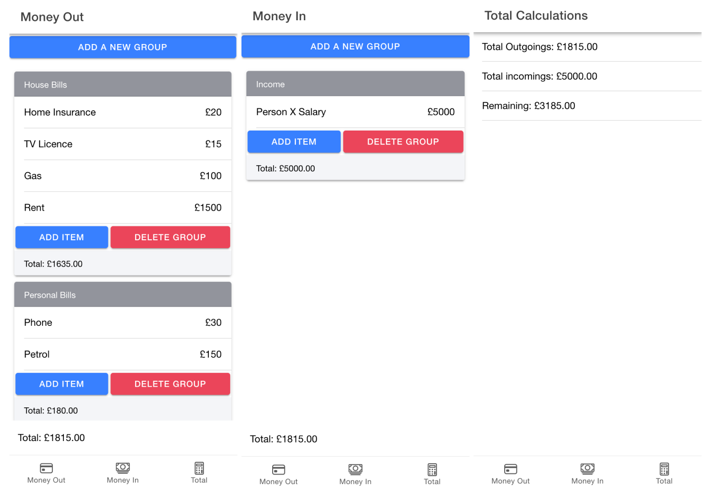

<h1 align="center">
Cash Flow Pro
</h1>
Simplify your finances with Cash Flow Pro: Just input your income and expenses, and instantly see your remaining funds.

#

## Table of contents

* [General info](#general-info)
* [Getting started](#getting-started)
* [Technologies](#technologies)
* [Features](#features)
* [Screenshots](#screenshots)
* [Live Demo](#live-demo)

## General info

Discover the power of effortless financial management with Cash Flow Pro. Born from my own search for simplicity, this app streamlines your finances. Input your income and expenses to instantly see remaining funds, empowering smart choices. It's tailored for individuals and business owners, and uses local storage for an even more simplified solution.

## Getting started

To run the app in development mode, execute:

```bash
ionic serve
```

This opens the app at [http://localhost:8100](http://localhost:8100) in your browser.

For production build, use:

```bash
ionic build --prod
```

This optimises Ionic / Angular for production and prepares the app in the www folder. The build is minified, with filenames including unique hashes for effective deployment.

## Technologies

Project is created with:

* Ionic
* Capacitor
* Angular

## Features

* Input your income and expenses to track your financial situation.
* See the remaining funds instantly after entering your financial data.
* Supports both dark and light modes for a personalized experience.
* Data is stored locally for privacy and convenience.

## Screenshots



## Live Demo

Experience Cash Flow Pro live:

[Cash Flow Pro](https://cash-flow-pro.web.app/)
